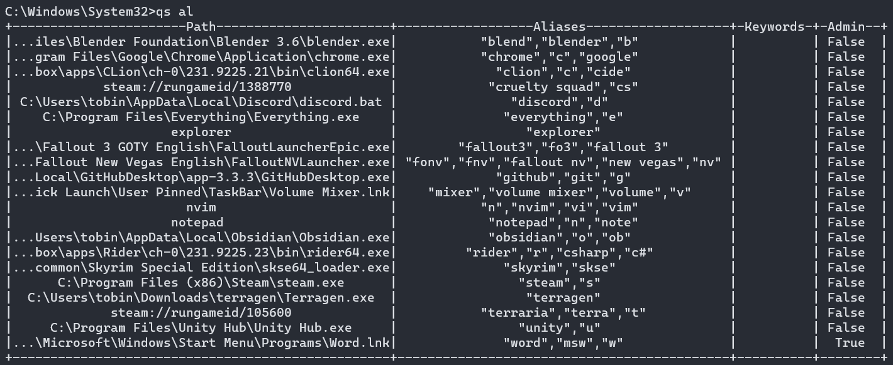
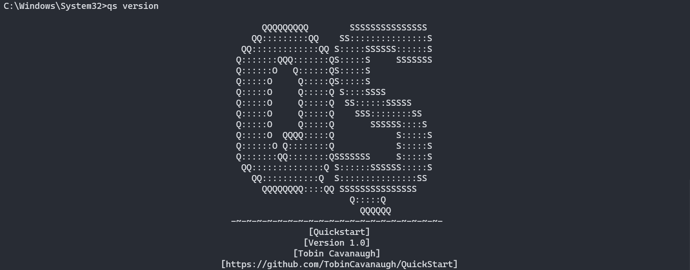
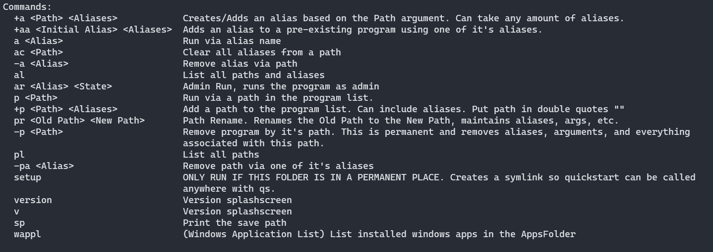
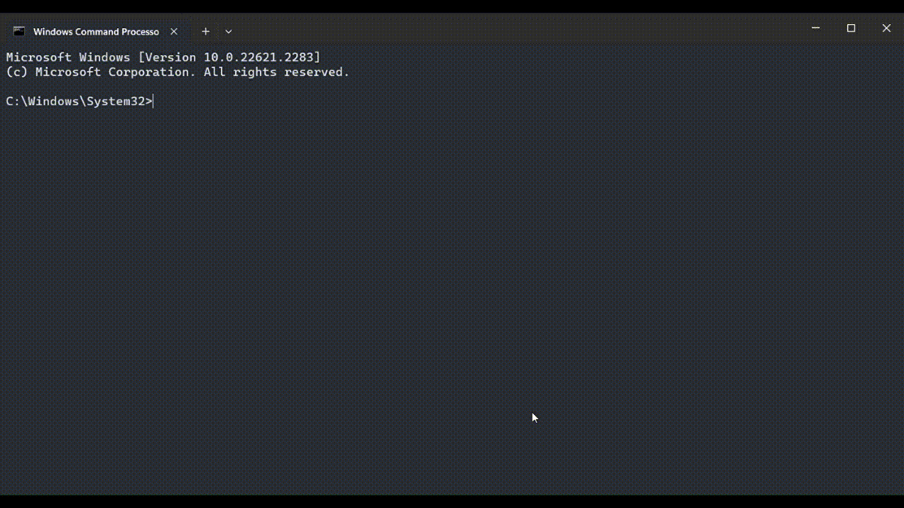
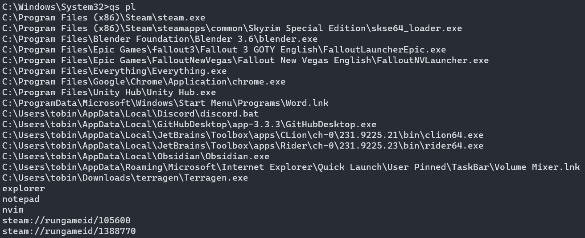

# Quickstart
A CLI program launcher made for ease of use.

---

### Installing:
1. Download the newest release zip
2. Extract to a permanent location ie. (`C:\\Program Files\\Quickstart\\`)
3. Open the command prompt in the folder where `qs.exe` is located.
4. Run the command `qs setup`
5. Quickstart is now installed and set up! See `Using Quickstart` to continue

---

### Using Quickstart:
1. Open the command prompt.
2. Run the command `qs +a "<Path>" <Aliases>`. Replace the path with the location of the executable (or command), place in quotes! After the path add space seperated aliases 
3. To confirm it was added, call `qs al` or `qs al --nf` to list the programs and their aliases, `--nf` is for no formatting. 
 
4. Your program can now be launched by calling `qs a <Alias>`! 
 
5. You can append new aliases at any point by calling `qs +aa <original> <new>`. Just like `+a` you can do an arbitrary amount of new paths.

---

### Command List `qs -?`:
- `qs +a <Path> <Aliases>` adds a program via its path, use any amount of space separated aliases.
- `qs +aa <Original> <Aliases>` to add aliases to an existing alias. Original is the original alias, Aliases are the space seperated new aliases.
- `qs a <Alias>` command to launch your program.
- `qs -a <Alias>` removes all instances of the corresponding aliases, keeps the program and the path.
- `qs ar <Alias> <State>` to force `qs a` to run your program in admin mode. Make sure to set state to true or false depending on if you want it to launch in admin.
- `qs p <Path>` launches the program via path. Not helpful.
- `qs +p <Path> <Aliases>` equivalent to `qs +a`
- `qs pr <OldPath> <NewPath>` replaces the path of the OldPath to the NewPath. This retains any information besides the path.
- `qs -p <Path>` removes the path and ALL its associated information PERMANENTLY.
- `qs pl` lists the paths as regular text without any formatting or extra information.
- `qs setup` See Installing:
- `qs version` and `qs v` prints out the Quickstart version splashscreen. 
- `qs sp` Prints out the location of the save path where application locations and all information is stored.
- `qs wappl` Prints out the windows app list, along with paths and names. If the paths are getting cut off use `qs wappl -nf` to print without significant formatting.

---

### Media:
> `qs version` / `qs v`

> `qs -?`

> `qs al`

> `qs pl`

