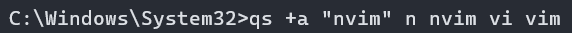

# Quickstart
A CLI program launcher made for ease of use.

### Installing:
1. Download the newest release zip
2. Extract to a permanent location ie. (`C:\\Program Files\\Quickstart\\`)
3. Open the command prompt in the folder where `qs.exe` is located.
4. Run the command `qs setup`
5. Quickstart is now installed and set up! See `Using Quickstart` to continue

### Using Quickstart
1. Open the command prompt.
2. Run the command `qs +a "<Path>" <Aliases>`. Replace the path with the location of the executable (or command), place in quotes! After the path add space seperated aliases 
3. To confirm it was added, call `qs al` or `qs al --nf` to list the programs and their aliases, `--nf` is for no formatting. 
 
4. Your program can now be launched by calling `qs a <Alias>`! 
5. You can append new aliases at any point by calling `qs +aa <original> <new>`. Just like `+a` you can do an arbitrary amount of new paths.

### Running Programs
1. Use the `qs a <alias>` command to launch your program