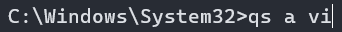

# Quickstart
A CLI program launcher made for ease of use.

### Installing:
1. Download the newest release zip
2. Extract to a permanent location ie. (`C:\\Program Files\\Quickstart\\`)
3. Open the command prompt in the folder where `qs.exe` is located.
4. Run the command `qs setup`
5. Quickstart is now installed and set up! See `Using Quickstart` to continue

### Using Quickstart
1. Open the command prompt.
2. Run the command `qs +a "<Path>" <Aliases>`. Replace the path with the location of the executable (or command), place in quotes! After the path add space seperated aliases

3. Your program can now be launched by calling `qs a <Alias>`!

4. 